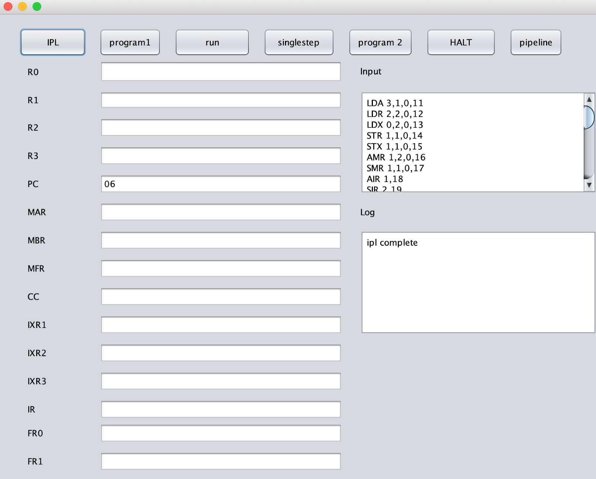

# ComputerSystemSimulator
In this project we will design, implement and test a simulator to simulate a basic machine. The project principally focusing on the ISA and how it is executed, memory structure, and simple I/O capabilities. A deeper understanding of the design, structure, and operations of a computer system is addressed. What's more, we get to experience some of the tradeoff decisions that computer designers make.

## Table of Contents

- [Background](#background)
- [Install](#install)
- [Usage](#usage)
- [Contributors](#contributors)

## Background

Our computer is a 16-bit processor that eventually accommodates both fixed-point and floating-point arithmetic operations. Unified cahe with fully associate mapping, vactor operations, and simple pipeline are implemented. 

Project Mannual is avilable at:
http://www.mslcourses.com/CSCI6461Section10Fall2019/AdaptedKaislerFiles/ClassProjectDescription.doc

## Install
### Run Simulator
You can choose either: 

- [ ] Run the pre-compiled JAR file [cs_simulator.jar](cs.simulator.jar)

- [ ] Manually compile the project by cloning it to your local computer.

### User Guide

For more details on how to use the simulator and what happens when you click on the buttons, please refer to [UserGuide.md](UserGuide.md).

## Usage
### Implementation Details
The project is structured into six packages, which are cs, Memory, Registers, Instruction, Utilities and program. 

1. CS: The simulator class in this package implemented the user interface. For more details on how to use the simulator and what happens when you click on the button, please refer to [UserGuide.md](UserGuide.md).

2. Memory:  There are two classes in this package, called Memory and Cache. Memory is represented by an array of size 2048. The data in instances of memory array are represented in the format of decimal. Cache is comprised of several 16-bit long cache lines, and cache line is implemented using linked list. We implement an add function to add elements into cache.

3. Registers: A class called Registers is implemented in this package. The constructor of this class initialize all the registers with random values, which are in the format of string. The register number of general purpose registers and index registers are decimal numbers. For each type of register, functions set<RegisterName> and get<RegisterName> are implemented to read and write data from and into the designated registers. 
  
4. Instruction: In this package, we separated instructions into different classes based on the type of instruction. There are seven classes in this package, called Instruction, LoadStore, Logic, Arithmetic, Transfer, ShiftRotate and IO_Operation, and each class handles the execution for a specific type of instruction. 

5. Utilities: There are three classes implemented in this package, called DataTypeConvert, Decode and EffectiveAddress. DataTypeConvert deals with issues about data, like convert between different data types and adding padding zeros. Decode acts as a media between cs and Instruction packages to decode the input instructions. EffectiveAddress is used to calculate the effective address. 

6. program: Program package includes program1.class and program2.class. In program1.class, program1.txt will be read in and sent into our simulator. In program2.class, program2.txt will be read in and sent into our simulator. 

For more information, please refer to [DesignNotes.md](DesignNotes.md)

### Testing Programs

1. Testing Program 1

A program that reads 20 numbers (integers) from the keyboard, prints the numbers to the console printer, requests a number from the user, and searches the 20 numbers read in for the number closest to the number entered by the user. Print the number entered by the user and the number closest to that number. Your numbers should not be 1…10, but distributed over the range of 0 … 65,535. Therefore, as you read a character in, you need to check it is a digit, convert it to a number, and assemble the integer.

2. Testing Program 2

A program that reads a set of a paragraph of 6 sentences from a file into memory. It prints the sentences on the console printer. It then asks the user for a word. It searches the paragraph to see if it contains the word. If so, it prints out the word, the sentence number, and the word number in the sentence.

## Contributors
[@ya-gao](https://github.com/ya-gao)

[@dilipvarma3](https://github.com/dilipvarma3)

[zwang61](https://github.com/zwang61)
